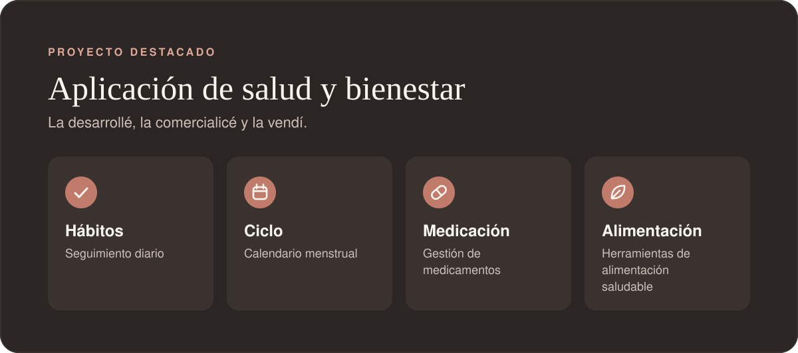
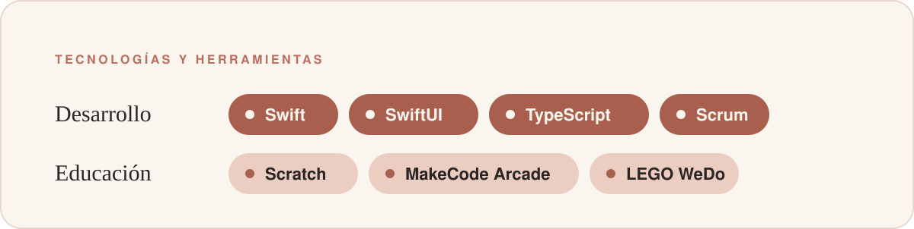
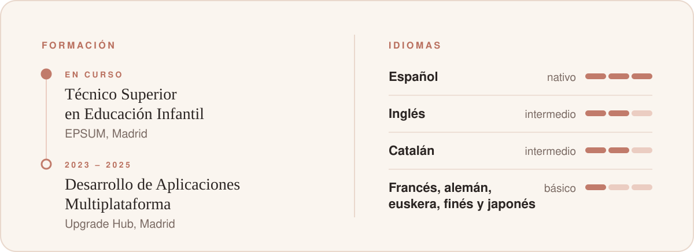

 

  

Enseño a niñas y niños de Primaria a programar y construir robots,  y desarrollo aplicaciones con Swift y TypeScript.

 

  

  

  

  

  

  

Gracias por pasar por aquí. Si quieres hablar de educación, robótica o apps, <a href="mailto:alishaeditora@icloud.com">escríbeme</a>.

